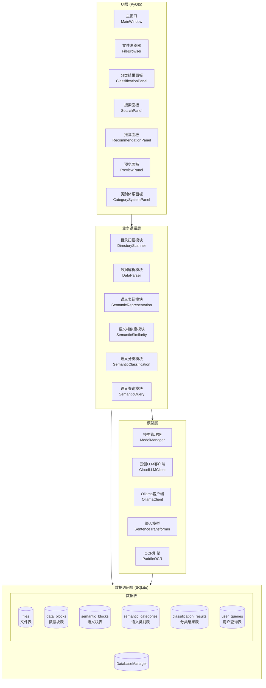
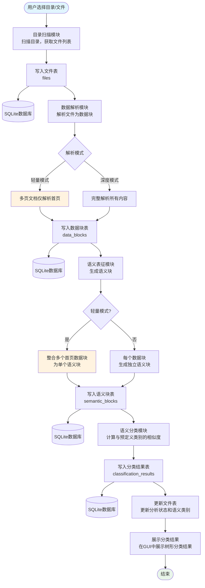
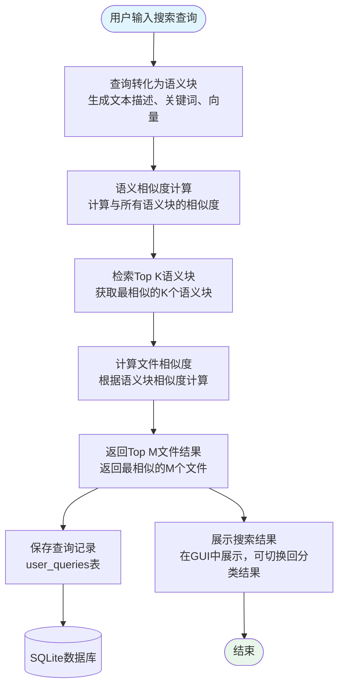
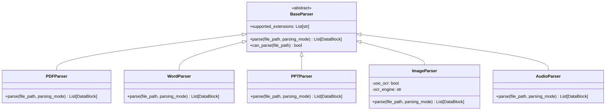
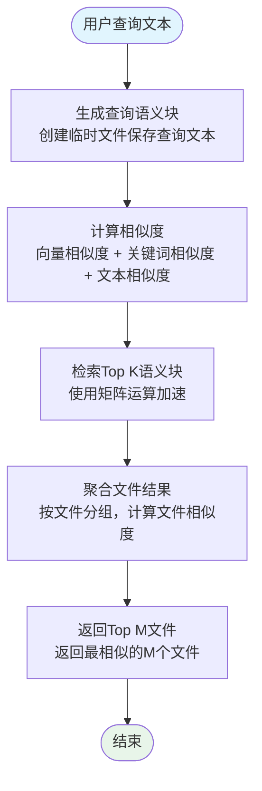

# File Analyzer 项目程序设计文档

## 1. 项目概述

File Analyzer 是一个多功能文件分析工程，支持多种文件格式（PPT、Word、PDF、WAV、JPG等）的解析和分析。通过数据解析、语义表征、语义相似度计算和语义分类等模块，实现对不同模态文件的统一处理和分析。

### 1.1 主要功能

- **多格式文件解析**：支持PDF、Word、PPT、图片和音频等多种文件格式的解析
- **语义表征**：将不同模态的数据转化为统一的语义表示（文本描述、关键词、语义向量）
- **语义相似度计算**：融合向量相似度、BM25分数和关键词相似度
- **语义分类**：基于预定义语义类别进行文件分类，支持多类别体系管理
- **LLM集成**：支持云侧大模型（OpenAI、通义千问、智谱GLM等）和本地Ollama模型
- **OCR文本提取**：支持图片OCR识别，提取图片中的文字内容
- **数据库持久化**：使用SQLite存储文件信息、数据块、语义块和分类结果
- **GUI界面**：提供PyQt5图形用户界面，支持目录扫描、文件分析和结果展示

### 1.2 技术栈

- **编程语言**：Python 3.10+
- **GUI框架**：PyQt5
- **数据库**：SQLite3
- **核心依赖**：
  - sentence-transformers（语义向量生成）
  - paddleocr/paddlepaddle（OCR文字识别）
  - jieba（中文分词）
  - numpy（数值计算）
  - pdfplumber/pymupdf（PDF解析）
  - python-pptx（PPT解析）
  - python-docx（Word解析）
  - Pillow（图片处理）
  - requests（云侧API调用）

## 2. 系统架构

### 2.1 整体架构



### 2.2 模块说明

| 模块 | 功能描述 | 主要文件 |
|------|---------|----------|
| **UI模块** | 提供图形用户界面 | `ui/main_window.py`, `ui/file_browser.py`, `ui/classification_panel.py`, `ui/category_system_panel.py` |
| **目录扫描模块** | 扫描本地目录，获取文件列表 | `directory_scanner/directory_scanner.py` |
| **数据解析模块** | 解析不同格式文件为数据块 | `data_parser/data_parser.py`, `data_parser/pdf_parser.py`, `data_parser/image_parser.py` |
| **语义表征模块** | 生成语义块（文本描述、关键词、向量） | `semantic_representation/semantic_representation.py` |
| **语义相似度模块** | 计算语义块之间的相似度 | `semantic_similarity/semantic_similarity.py` |
| **语义分类模块** | 基于预定义类别对文件分类 | `semantic_classification/semantic_classification.py` |
| **语义查询模块** | 支持多种方式的语义查询 | `semantic_query/semantic_query.py` |
| **模型管理模块** | 统一管理AI模型生命周期 | `models/model_manager.py` |
| **云侧LLM模块** | 调用云侧大模型API | `models/cloud_llm_client.py` |
| **数据库模块** | SQLite数据库操作 | `database/database.py` |

### 2.3 核心业务流程



### 2.4 语义搜索流程



## 3. 模块设计

### 3.1 模型管理模块

#### 3.1.1 功能说明

模型管理模块 (`ModelManager`) 采用单例模式，统一管理所有AI模型的生命周期，避免重复加载，优化内存占用和初始化时间。

#### 3.1.2 管理的模型

| 模型 | 大小 | 说明 |
|------|------|------|
| SentenceTransformer | 约420MB | 语义向量生成模型 |
| PaddleOCR | 约100-200MB | OCR文字识别模型 |
| jieba词典 | 约50MB | 中文分词词典 |
| LLM客户端 | - | 云侧/本地大模型接口 |

#### 3.1.3 LLM支持

支持两种LLM类型：

| 类型 | 说明 | 配置项 |
|------|------|--------|
| **cloud** | 云侧大模型API | OpenAI、通义千问、智谱GLM、DeepSeek、Kimi等 |
| **ollama** | 本地Ollama服务 | 需要本地部署Ollama |

#### 3.1.4 核心方法

```python
class ModelManager:
    def get_embedding_model(self, model_name: str) -> SentenceTransformer
    def get_ocr_instance(self, use_ocr: bool = True) -> Callable
    def get_llm_client(self) -> Union[CloudLLMClient, OllamaClient]
    def is_llm_available(self) -> bool
    def aggressive_cleanup(self)  # 积极内存清理
```

### 3.2 云侧LLM客户端

#### 3.2.1 功能说明

云侧LLM客户端 (`CloudLLMClient`) 封装了OpenAI兼容API格式的云侧大模型调用，支持多种服务商。

#### 3.2.2 支持的服务商

| 服务商 | base_url | 推荐模型 |
|--------|----------|----------|
| OpenAI | `https://api.openai.com/v1` | gpt-4o, gpt-4o-mini |
| 阿里云通义千问 | `https://dashscope.aliyuncs.com/compatible-mode/v1` | qwen-turbo, qwen-plus, qwen-max |
| 智谱AI | `https://open.bigmodel.cn/api/paas/v4` | glm-4, glm-4-plus |
| DeepSeek | `https://api.deepseek.com/v1` | deepseek-chat |
| Kimi | `https://api.moonshot.cn/v1` | moonshot-v1-8k |

#### 3.2.3 核心方法

```python
class CloudLLMClient:
    def check_service_available(self) -> bool
    def generate_text(self, prompt: str) -> str
    def generate_image_description(self, image_path: str, detail_level: str) -> str
    def classify_text(self, text: str, categories: List[str]) -> Dict
    def classify_image(self, image_path: str, categories: List[str]) -> Dict
    def generate_category_info(self, category_name: str) -> Dict
```

### 3.3 数据解析模块

#### 3.3.1 功能说明

数据解析模块负责将不同格式的文件解析为统一的数据块（DataBlock），支持PDF、Word、PPT、图片和音频等多种格式。

#### 3.3.2 数据块结构

```python
@dataclass
class DataBlock:
    block_id: str                    # 数据块唯一标识
    modality: ModalityType           # 模态类型（text/image/table/audio/video）
    addr: Optional[str] = None       # 数据块文件路径（cache目录下）
    metadata: Dict[str, Any] = {}    # 元数据
    file_path: Optional[str] = None  # 源文件路径
    page_number: Optional[int] = None  # 页码
    position: Optional[Dict] = None  # 位置信息
```

**关键设计**：数据块内容不直接存储在对象中，而是保存到cache目录下的文件，通过`addr`字段引用。这样可以：
- 减少内存占用
- 支持大文件处理
- 便于持久化

#### 3.3.3 解析模式

| 模式 | 说明 | 适用场景 |
|------|------|----------|
| **轻量解析** (mode=1) | 多页文档仅解析首页，生成多个数据块；所有类型最终整合为单个语义块 | 快速预览、初步分析 |
| **深度解析** (mode=2) | 完整解析文件，保留所有数据块，每个数据块生成独立语义块 | 详细分析、全文索引 |

#### 3.3.4 类关系



### 3.4 语义表征模块

#### 3.4.1 功能说明

语义表征模块负责将数据块转化为统一的语义表示（SemanticBlock），包括文本描述、关键词和语义向量。

#### 3.4.2 语义块结构

```python
@dataclass
class SemanticBlock:
    block_id: str                      # 语义块ID
    text_description: str              # 文本描述
    keywords: List[str]                # 关键词列表
    semantic_vector: np.ndarray        # 语义向量
    modality: str                      # 模态类型
    original_metadata: Dict[str, Any]  # 原始元数据
```

#### 3.4.3 核心方法

| 方法名 | 参数 | 返回值 | 功能描述 |
|-------|------|--------|----------|
| `represent` | block: DataBlock, db_manager, data_block_id, file_id | SemanticBlock | 生成语义块并写入数据库 |
| `represent_batch` | blocks: List[DataBlock] | List[SemanticBlock] | 批量生成语义块 |
| `represent_first_page_blocks` | blocks, db_manager, file_id, max_length | SemanticBlock | 整合首页多个数据块为单个语义块（轻量模式） |
| `encode_single` | text: str | np.ndarray | 编码单个文本为语义向量 |
| `extract` | text: str | List[str] | 提取文本关键词（使用jieba） |

### 3.5 语义分类模块

#### 3.5.1 功能说明

语义分类模块负责将语义块分类到预定义的语义类别中，支持基于相似度的分类方法。该模块通过计算语义块与各预定义类别之间的相似度，选择最匹配的类别作为分类结果。

#### 3.5.2 分类方法

| 方法 | 说明 | 配置项 |
|------|------|--------|
| **similarity** | 使用语义相似度计算分类 | `classification.method: similarity` |
| **clustering** | 使用语义聚类分类 | `classification.method: clustering` |

#### 3.5.3 类别体系管理

支持多类别体系管理，可以从目录结构自动提取类别：

```python
class CategorySystem:
    name: str              # 类别体系名称
    categories: List[str]  # 类别列表
```

**功能**：
- 添加/删除/重命名类别体系
- 从目录结构自动提取类别
- 类别体系选择对话框
- 数据库持久化

#### 3.5.4 相似度权重配置

```json
{
    "similarity_weights": {
        "vector_weight": 0.35,
        "bm25_weight": 0.30,
        "keyword_weight": 0.35,
        "time_weight": 0.0,
        "location_weight": 0.0
    }
}
```

### 3.6 语义查询模块

#### 3.6.1 功能说明

语义查询模块提供基于语义相似度的文件检索功能。用户输入查询文本后，系统将查询转化为语义块，计算与数据库中所有语义块的相似度，返回最相关的文件列表。

#### 3.6.2 查询流程



#### 3.6.3 性能优化

1. **向量矩阵缓存**：预先加载所有语义块向量，构建矩阵进行批量计算
2. **关键词索引**：预构建关键词倒排索引，加速关键词匹配
3. **延迟加载**：只在首次搜索时加载语义块缓存

### 3.7 数据库模块

#### 3.7.1 功能说明

数据库模块使用SQLite存储文件信息、数据块、语义块和分类结果，支持分析状态管理和历史数据清空。

#### 3.7.2 文件分析状态

```python
class FileStatus(IntEnum):
    PENDING = 0      # 待处理（刚扫描入库）
    PARSED = 1       # 已解析（数据块已生成，保存到cache）
    PRELIMINARY = 2  # 初步分析（语义表征已生成）
    DEEP = 3         # 深入分析（全文文本索引）
```

#### 3.7.3 批量操作优化

提供批量操作方法，使用`executemany`和单次事务提交，比逐条插入快约50倍：

- `add_files_batch(files: List[Dict]) -> int`
- `add_data_blocks_batch(blocks: List[Dict]) -> int`
- `add_semantic_blocks_batch(blocks: List[Dict]) -> int`
- `add_classification_results_batch(results: List[Dict]) -> int`

### 3.8 UI模块

#### 3.8.1 功能说明

UI模块基于PyQt5提供图形用户界面，包括主窗口、文件浏览器、分类结果面板、搜索面板、类别体系面板等组件。

#### 3.8.2 主要组件

| 组件 | 文件 | 功能描述 |
|------|------|----------|
| **主窗口** | `main_window.py` | 应用程序主窗口，整合各功能模块，多线程处理 |
| **文件浏览器** | `file_browser.py` | 树形目录结构展示 |
| **分类结果面板** | `classification_panel.py` | 展示分类结果和搜索结果的树形结构，支持模式切换 |
| **搜索面板** | `search_panel.py` | 提供搜索功能 |
| **推荐面板** | `recommendation_panel.py` | 显示推荐内容 |
| **预览面板** | `preview_panel.py` | 文件预览功能 |
| **类别体系面板** | `category_system_panel.py` | 类别体系管理，支持添加/删除/重命名 |

#### 3.8.3 多线程处理

使用QThread进行后台处理，避免UI阻塞：

- `ParseWorker`：文件解析工作线程
- `SemanticRepresentWorker`：语义表征工作线程
- `ClassificationWorker`：分类计算工作线程

## 4. 数据库设计

### 4.1 文件表 (files)

| 字段名 | 数据类型 | 约束 | 描述 |
|-------|---------|------|------|
| `id` | INTEGER | PRIMARY KEY AUTOINCREMENT | 文件ID |
| `file_path` | TEXT | NOT NULL, UNIQUE | 文件完整路径 |
| `file_name` | TEXT | NOT NULL | 文件名 |
| `file_size` | INTEGER | DEFAULT 0 | 文件大小（字节） |
| `file_type` | TEXT | | 文件类型（扩展名） |
| `modified_time` | TIMESTAMP | | 文件修改时间 |
| `created_time` | TIMESTAMP | | 文件创建时间 |
| `analysis_status` | INTEGER | DEFAULT 0 | 分析状态（0:待分析, 1:已解析, 2:初步分析, 3:深入分析） |
| `semantic_categories` | TEXT | | 语义类别JSON `[{"category": "...", "confidence": 0.85}, ...]` |
| `directory_path` | TEXT | NOT NULL | 所在目录路径 |
| `added_time` | TIMESTAMP | DEFAULT CURRENT_TIMESTAMP | 添加到数据库时间 |
| `semantic_filename` | TEXT | | 语义文件名（用于搜索） |

### 4.2 数据块表 (data_blocks)

| 字段名 | 数据类型 | 约束 | 描述 |
|-------|---------|------|------|
| `id` | INTEGER | PRIMARY KEY AUTOINCREMENT | 数据块ID |
| `block_id` | TEXT | NOT NULL, UNIQUE | 数据块唯一标识 |
| `file_id` | INTEGER | NOT NULL, FOREIGN KEY | 关联文件ID |
| `modality` | TEXT | NOT NULL | 模态类型（text/image/table/audio/video） |
| `addr` | TEXT | | 数据块文件路径（cache目录下） |
| `page_number` | INTEGER | DEFAULT 1 | 页码（PDF/Word/PPT） |
| `position` | TEXT | | 位置信息JSON |
| `metadata` | TEXT | | 元数据JSON |
| `created_time` | TIMESTAMP | DEFAULT CURRENT_TIMESTAMP | 创建时间 |

**关键变更**：
- 移除了`content`和`text_content`字段，改为使用`addr`字段引用cache目录下的文件
- 这样可以减少数据库体积，支持大文件处理

### 4.3 语义块表 (semantic_blocks)

| 字段名 | 数据类型 | 约束 | 描述 |
|-------|---------|------|------|
| `id` | INTEGER | PRIMARY KEY AUTOINCREMENT | 语义块ID |
| `semantic_block_id` | TEXT | NOT NULL, UNIQUE | 语义块唯一标识 |
| `data_block_ids` | TEXT | | 关联数据块ID列表（JSON数组），支持一个语义块关联多个数据块 |
| `file_id` | INTEGER | NOT NULL, FOREIGN KEY | 关联文件ID |
| `text_description` | TEXT | | 文本描述 |
| `keywords` | TEXT | | 关键词JSON数组 |
| `semantic_vector` | BLOB | | 语义向量（numpy数组字节） |
| `created_time` | TIMESTAMP | DEFAULT CURRENT_TIMESTAMP | 创建时间 |
| `semantic_filename` | TEXT | | 语义文件名 |

### 4.4 语义类别表 (semantic_categories)

| 字段名 | 数据类型 | 约束 | 描述 |
|-------|---------|------|------|
| `id` | INTEGER | PRIMARY KEY AUTOINCREMENT | 类别ID |
| `category_name` | TEXT | NOT NULL | 类别名称 |
| `description` | TEXT | | 类别描述 |
| `keywords` | TEXT | | 类别关键词JSON数组 |
| `category_system_name` | TEXT | DEFAULT '默认类别体系' | 所属类别体系名称 |
| `created_time` | TIMESTAMP | DEFAULT CURRENT_TIMESTAMP | 创建时间 |

**唯一约束**：`UNIQUE(category_name, category_system_name)`

**关键变更**：
- 新增`category_system_name`字段，支持多类别体系管理
- 同一类别名称可以在不同类别体系中存在

### 4.5 分类结果表 (classification_results)

| 字段名 | 数据类型 | 约束 | 描述 |
|-------|---------|------|------|
| `id` | INTEGER | PRIMARY KEY AUTOINCREMENT | 结果ID |
| `file_id` | INTEGER | NOT NULL, FOREIGN KEY | 关联文件ID |
| `semantic_block_id` | TEXT | NOT NULL | 关联语义块ID |
| `category_name` | TEXT | NOT NULL | 类别名称 |
| `category_system_name` | TEXT | DEFAULT '默认类别体系' | 使用的类别体系名称 |
| `confidence` | REAL | DEFAULT 0.0 | 置信度（0-1） |
| `all_scores` | TEXT | | 所有类别得分JSON |
| `created_time` | TIMESTAMP | DEFAULT CURRENT_TIMESTAMP | 创建时间 |

**关键变更**：
- 新增`category_system_name`字段，记录分类使用的类别体系

### 4.6 用户查询表 (user_queries)

| 字段名 | 数据类型 | 约束 | 描述 |
|-------|---------|------|------|
| `id` | INTEGER | PRIMARY KEY AUTOINCREMENT | 查询ID |
| `query_text` | TEXT | NOT NULL | 查询文本 |
| `query_vector` | BLOB | | 查询向量（numpy数组字节） |
| `keywords` | TEXT | | 查询关键词JSON数组 |
| `top_k` | INTEGER | DEFAULT 10 | 检索的语义块数量 |
| `top_m` | INTEGER | DEFAULT 5 | 返回的文件数量 |
| `result_count` | INTEGER | DEFAULT 0 | 实际返回结果数量 |
| `created_time` | TIMESTAMP | DEFAULT CURRENT_TIMESTAMP | 创建时间 |

### 4.7 数据库索引

```sql
CREATE INDEX idx_files_path ON files(file_path);
CREATE INDEX idx_files_status ON files(analysis_status);
CREATE INDEX idx_files_directory ON files(directory_path);
CREATE INDEX idx_data_blocks_file ON data_blocks(file_id);
CREATE INDEX idx_semantic_blocks_file ON semantic_blocks(file_id);
CREATE INDEX idx_classification_file ON classification_results(file_id);
CREATE INDEX idx_user_queries_time ON user_queries(created_time);
```

## 5. 配置文件

### 5.1 配置文件位置

`config.json`

### 5.2 配置项说明

```json
{
    "initial_directory": "D:/张美娜找工作-2026",
    "low_memory_mode": {
        "enabled": true,
        "periodic_memory_cleanup": {
            "enabled": true,
            "file_interval": 50
        }
    },
    "classification": {
        "method": "similarity"
    },
    "query": {
        "top_k": 10,
        "top_m": 5
    },
    "logging": {
        "enabled": true,
        "level": "INFO"
    },
    "performance": {
        "enabled": true,
        "log_file": "logs/performance.log",
        "log_interval_seconds": 5,
        "track_memory": true,
        "track_latency": true
    },
    "similarity_weights": {
        "vector_weight": 0.35,
        "bm25_weight": 0.3,
        "keyword_weight": 0.35,
        "time_weight": 0.0,
        "location_weight": 0.0
    },
    "category_text_fields": {
        "vector": ["name", "description", "keywords"],
        "bm25": ["name"]
    },
    "semantic_text_fields": {
        "vector": ["semantic_filename", "text_description"],
        "bm25": ["semantic_filename", "text_description"]
    },
    "semantic_representation": {
        "image": {
            "use_ocr": true,
            "ocr_model": "paddleocr",
            "ocr_model_path": "",
            "ocr_max_image_width": 1500,
            "enable_mkldnn": true
        },
        "embedding": {
            "type": "sentence_transformer",
            "model_name": "paraphrase-multilingual-MiniLM-L12-v2"
        },
        "keyword": {
            "method": "jieba",
            "top_k": 10
        },
        "description": {
            "max_length": 512
        },
        "filename_semantic": {
            "enabled": true,
            "include_in_vector": true,
            "include_in_bm25": true,
            "min_meaningful_chars": 3,
            "chinese_ratio_threshold": 0.3
        }
    },
    "parsing": {
        "mode": 1,
        "light_mode_max_length": 256,
        "pdf_image_mode": "page_render",
        "pdf_image_output_dir": "cache/pdf_images",
        "pdf_render_dpi": 100
    },
    "llm": {
        "type": "cloud",
        "cloud": {
            "api_key": "your-api-key",
            "base_url": "https://open.bigmodel.cn/api/paas/v4",
            "model": "glm-4.7",
            "vision_model": "glm-4.7",
            "timeout": 120,
            "max_tokens": 128000,
            "temperature": 0.7
        },
        "ollama": {
            "base_url": "http://localhost:11434",
            "model": "qwen3.5:0.8b",
            "keep_alive": "10m"
        }
    },
    "category_systems": [...],
    "categories": [...]
}
```

### 5.3 LLM配置详解

| 配置项 | 类型 | 默认值 | 说明 |
|-------|------|-------|------|
| `llm.type` | string | "cloud" | LLM类型：cloud/ollama |
| `llm.cloud.api_key` | string | - | 云侧API密钥 |
| `llm.cloud.base_url` | string | - | 云侧API基础URL |
| `llm.cloud.model` | string | - | 模型名称 |
| `llm.cloud.vision_model` | string | - | 视觉模型名称 |
| `llm.cloud.timeout` | int | 120 | API调用超时时间（秒） |
| `llm.cloud.max_tokens` | int | 2048 | 最大生成token数 |
| `llm.cloud.temperature` | float | 0.7 | 生成温度 |
| `llm.ollama.base_url` | string | "http://localhost:11434" | Ollama服务地址 |
| `llm.ollama.model` | string | "qwen3.5:0.8b" | Ollama模型名称 |
| `llm.ollama.keep_alive` | string | "10m" | 模型内存保持时间 |

### 5.4 低内存模式配置

| 配置项 | 类型 | 默认值 | 说明 |
|-------|------|-------|------|
| `low_memory_mode.enabled` | bool | true | 是否启用低内存模式 |
| `low_memory_mode.periodic_memory_cleanup.enabled` | bool | true | 是否启用定期内存清理 |
| `low_memory_mode.periodic_memory_cleanup.file_interval` | int | 50 | 内存清理间隔（处理多少文件后清理） |

## 6. 开发规范

### 6.1 命名规范

- **类名**：使用驼峰命名法，首字母大写，如 `DataParser`
- **方法名**：使用驼峰命名法，首字母小写，如 `parse_file`
- **变量名**：使用小写字母和下划线，如 `file_path`
- **常量**：使用全大写字母和下划线，如 `DEFAULT_MODEL`
- **模块名**：使用小写字母和下划线，如 `data_parser`

### 6.2 代码风格

- **缩进**：使用4个空格缩进
- **行宽**：每行不超过120个字符
- **空行**：类之间、方法之间使用空行分隔
- **注释**：关键方法和复杂逻辑添加注释
- **异常处理**：使用 try-except 捕获异常，并记录日志

### 6.3 安全规范

- **输入验证**：对所有输入参数进行验证
- **文件操作**：使用安全的文件路径处理，避免路径遍历攻击
- **数据加密**：敏感数据进行加密存储
- **日志记录**：记录关键操作和异常信息

## 7. 测试

### 7.1 测试目录

`tests/`

### 7.2 测试文件

| 测试文件 | 功能描述 |
|----------|----------|
| `test_data_parser.py` | 数据解析模块测试 |
| `test_pdf_parser.py` | PDF解析器测试 |
| `test_directory_scanner.py` | 目录扫描模块测试 |
| `test_all.py` | 综合测试 |
| `test_cloud_llm.py` | 云侧LLM连接测试 |

### 7.3 测试数据

`test_data/` 和 `data_test_debug/`

## 8. 打包与部署

### 8.1 打包脚本

`build_exe.py` - 使用PyInstaller打包为可执行文件

### 8.2 打包配置

`文件分析管理器.spec` - PyInstaller配置文件

### 8.3 运行方式

1. **开发模式**：`python ui/main_window.py`
2. **打包后**：运行 `文件分析管理器.exe`

## 9. 潜在优化点

### 9.1 性能优化

1. **模型缓存**：缓存语义向量模型，避免重复加载（已实现）
2. **并行处理**：使用多线程并行处理文件（已实现）
3. **批量操作**：批量处理数据块和语义块（已实现）
4. **数据库优化**：使用索引加速查询（已实现）
5. **内存优化**：定期内存清理，OCR中间张量清理（已实现）

### 9.2 功能优化

1. **支持更多文件格式**：如Excel、Markdown等
2. **增强OCR功能**：提高图片OCR的准确性
3. **优化语义向量模型**：使用更先进的模型
4. **增加自定义类别**：支持用户自定义语义类别（已实现）

### 9.3 架构优化

1. **微服务拆分**：将核心模块拆分为独立的微服务
2. **容器化部署**：使用Docker容器化部署
3. **负载均衡**：添加负载均衡，支持高并发

## 10. 总结

File Analyzer 项目是一个功能完整的文件分析工程，通过模块化设计实现了对多种文件格式的解析和分析。项目采用Python语言开发，使用PyQt5提供图形界面，SQLite存储数据，支持OCR文字识别、语义分类和云侧大模型集成。

本设计文档详细介绍了项目的整体架构、核心模块、数据库设计和配置说明，同时提供了开发规范和潜在优化点。通过这些设计，项目具有良好的扩展性和可维护性，能够满足不同场景下的文件分析需求。

---

**文档版本**：v3.0
**更新日期**：2026-03-23
**主要更新**：
- 新增模型管理模块设计
- 新增云侧LLM客户端设计
- 新增类别体系管理功能
- 更新数据库表结构（新增字段、支持多类别体系）
- 更新配置文件说明（新增LLM配置、低内存模式配置）
- 更新数据块结构（使用addr字段引用cache文件）
- 新增性能优化说明