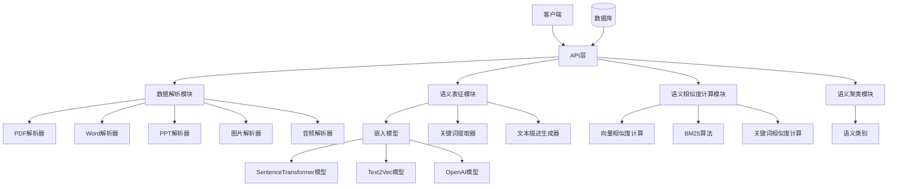
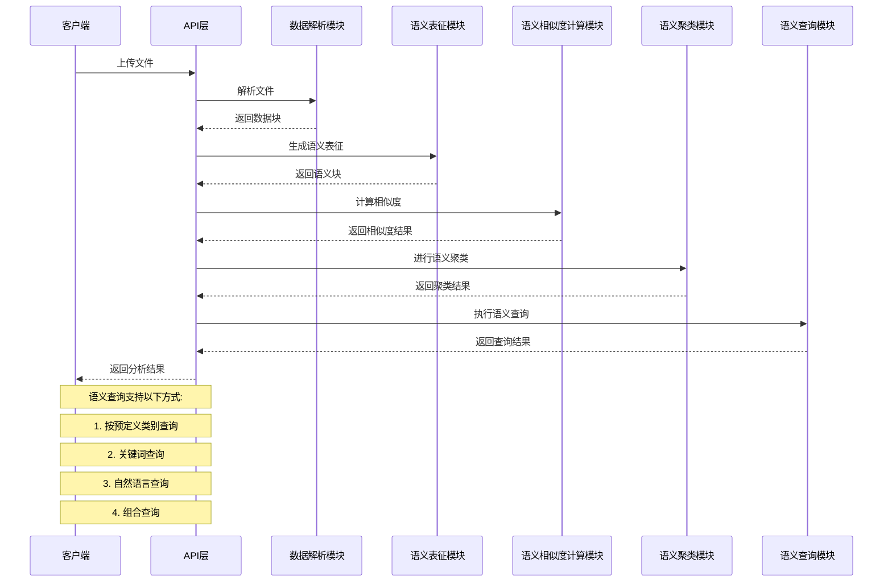
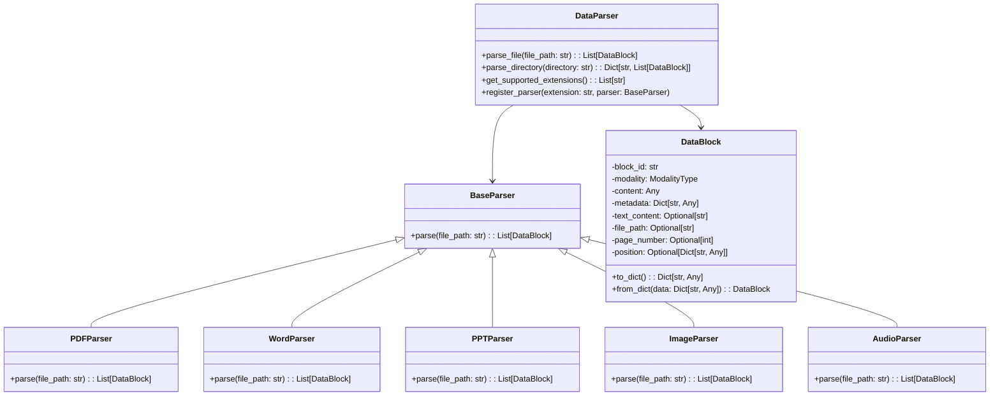
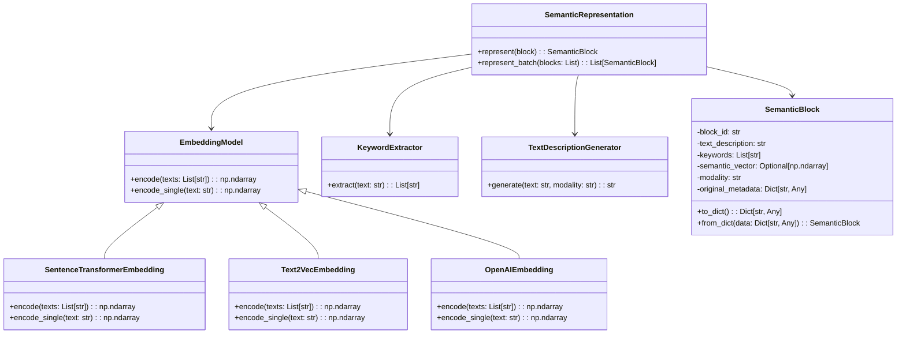
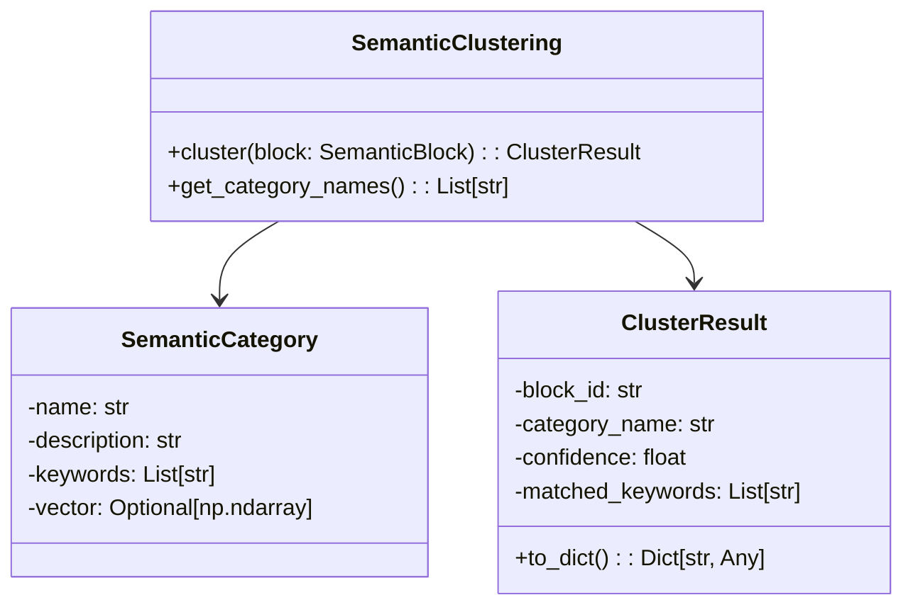
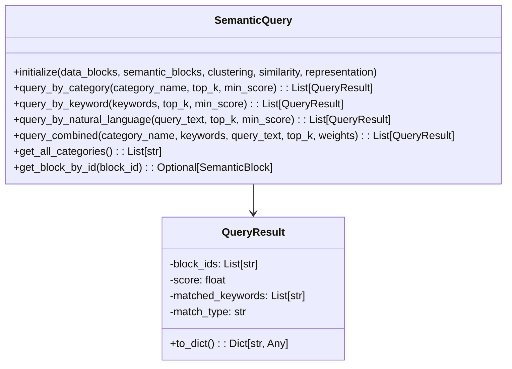

# File Analyzer 项目程序设计文档

## 1. 项目概述

File Analyzer 是一个多功能文件分析工程，支持多种文件格式（PPT、Word、PDF、WAV、JPG等）的解析和分析。通过数据解析、语义表征、语义相似度计算和语义聚类等模块，实现对不同模态文件的统一处理和分析。

### 1.1 主要功能

- **多格式文件解析**：支持PPT、Word、PDF、WAV、JPG等多种文件格式的解析
- **语义表征**：将不同模态的数据转化为统一的语义表示（文本描述、关键词、语义向量）
- **语义相似度计算**：融合向量相似度、BM25分数和关键词相似度
- **语义聚类**：基于预定义语义类别进行聚类分析

### 1.2 技术栈

- **编程语言**：Python
- **核心依赖**：
  - sentence-transformers（语义向量生成）
  - jieba（中文分词）
  - numpy（数值计算）
  - pdfplumber（PDF解析）
  - python-pptx（PPT解析）
  - python-docx（Word解析）
  - Pillow（图片处理）
  - pydub（音频处理）

## 2. 系统架构

### 2.1 整体架构



### 2.2 模块依赖关系

| 模块 | 依赖模块 | 描述 |
|------|---------|------|
| 数据解析模块 | 各格式解析器 | 解析不同格式文件 |
| 语义表征模块 | 嵌入模型、关键词提取器、文本描述生成器 | 生成语义表示 |
| 语义相似度计算模块 | 向量相似度、BM25、关键词相似度 | 计算相似度 |
| 语义聚类模块 | 语义类别 | 进行语义聚类 |
| API层 | 所有核心模块 | 提供RESTful接口 |

### 2.3 核心业务流程



## 3. 模块设计

### 3.1 数据解析模块

#### 3.1.1 功能说明

数据解析模块负责将不同格式的文件解析为统一的数据块（DataBlock），支持PDF、Word、PPT、图片和音频等多种格式。

#### 3.1.2 类关系



#### 3.1.3 核心方法

| 方法名 | 参数 | 返回值 | 功能描述 |
|-------|------|--------|----------|
| `parse_file` | file_path: str | List[DataBlock] | 解析单个文件为数据块 |
| `parse_directory` | directory: str, recursive: bool, extensions: Optional[List[str]] | Dict[str, List[DataBlock]] | 解析目录下的文件 |
| `get_supported_extensions` | 无 | List[str] | 获取支持的文件扩展名 |
| `register_parser` | extension: str, parser: BaseParser | 无 | 注册新的解析器 |

### 3.2 语义表征模块

#### 3.2.1 功能说明

语义表征模块负责将数据块转化为统一的语义表示（SemanticBlock），包括文本描述、关键词和语义向量。

#### 3.2.2 类关系



#### 3.2.3 核心方法

| 方法名 | 参数 | 返回值 | 功能描述 |
|-------|------|--------|----------|
| `represent` | block: DataBlock | SemanticBlock | 将单个数据块转化为语义块 |
| `represent_batch` | blocks: List[DataBlock] | List[SemanticBlock] | 批量将数据块转化为语义块 |
| `encode` | texts: List[str] | np.ndarray | 批量编码文本为语义向量 |
| `encode_single` | text: str | np.ndarray | 编码单个文本为语义向量 |
| `extract` | text: str | List[str] | 提取文本关键词 |
| `generate` | text: str, modality: str | str | 生成文本描述 |

### 3.3 语义相似度计算模块

#### 3.3.1 功能说明

语义相似度计算模块负责计算不同语义块之间的相似度，融合向量相似度、BM25分数和关键词相似度。

#### 3.3.2 类关系

```mermaid
classDiagram
    class SemanticSimilarity {
        +fit(target_blocks: List[SemanticBlock])
        +compute_similarity(query_block: SemanticBlock, target_block: SemanticBlock): SimilarityResult
        +search(query_block: SemanticBlock, top_k: int, min_score: float): List[SimilarityResult]
    }
    
    class BM25 {
        +fit(documents: List[List[str]])
        +get_score(query: List[str], doc_idx: int): float
        +get_scores(query: List[str]): np.ndarray
    }
    
    class VectorSimilarity {
        +cosine_similarity(vec1: np.ndarray, vec2: np.ndarray): float
        +cosine_similarity_matrix(query_vectors: np.ndarray, target_vectors: np.ndarray): np.ndarray
    }
    
    class KeywordSimilarity {
        +jaccard_similarity(keywords1: List[str], keywords2: List[str]): float
        +overlap_coefficient(keywords1: List[str], keywords2: List[str]): float
    }
    
    class TimeSimilarity {
        +extract_times(text: str): List[str]
        +time_similarity(times1: List[str], times2: List[str]): float
    }
    
    class LocationSimilarity {
        +extract_locations(text: str): List[str]
        +location_similarity(locations1: List[str], locations2: List[str]): float
    }
    
    class SimilarityResult {
        -query_id: str
        -target_id: str
        -vector_similarity: float
        -bm25_score: float
        -keyword_similarity: float
        -time_similarity: float
        -location_similarity: float
        -fused_score: float
        +to_dict(): Dict[str, Any]
    }
    
    SemanticSimilarity --> BM25
    SemanticSimilarity --> VectorSimilarity
    SemanticSimilarity --> KeywordSimilarity
    SemanticSimilarity --> TimeSimilarity
    SemanticSimilarity --> LocationSimilarity
    SemanticSimilarity --> SimilarityResult
```



#### 3.3.3 核心方法

| 方法名 | 参数 | 返回值 | 功能描述 |
|-------|------|--------|----------|
| `fit` | target_blocks: List[SemanticBlock] | 无 | 拟合目标语义块 |
| `compute_similarity` | query_block: SemanticBlock, target_block: SemanticBlock | SimilarityResult | 计算两个语义块之间的相似度 |
| `search` | query_block: SemanticBlock, top_k: int, min_score: float | List[SimilarityResult] | 搜索最相似的语义块 |
| `batch_search` | query_blocks: List[SemanticBlock], top_k: int, min_score: float | Dict[str, List[SimilarityResult]] | 批量搜索语义块 |
| `cosine_similarity` | vec1: np.ndarray, vec2: np.ndarray | float | 计算两个向量的余弦相似度 |
| `jaccard_similarity` | keywords1: List[str], keywords2: List[str] | float | 计算两个关键词列表的Jaccard相似度 |
| `extract_times` | text: str | List[str] | 从文本中提取时间信息 |
| `time_similarity` | times1: List[str], times2: List[str] | float | 计算时间相似度 |
| `extract_locations` | text: str | List[str] | 从文本中提取地点信息 |
| `location_similarity` | locations1: List[str], locations2: List[str] | float | 计算地点相似度 |

#### 3.3.4 相似度计算方法

系统融合以下五种相似度计算方法：

| 相似度类型 | 权重默认值 | 说明 |
|-----------|-----------|------|
| **向量相似度** | 0.3 | 使用余弦相似度计算语义向量之间的相似度 |
| **BM25分数** | 0.3 | 基于文本的BM25算法计算相似度 |
| **关键词相似度** | 0.2 | 使用Jaccard相似度计算关键词之间的相似度 |
| **时间相似度** | 0.1 | 计算时间信息的相似度，支持多种时间格式 |
| **地点相似度** | 0.1 | 计算地点信息的相似度，支持行政区划和常见城市 |

##### 时间相似度计算

**支持的格式**：
- YYYY-MM-DD（如：2024-01-15）
- YYYY/MM/DD（如：2024/01/15）
- YYYY年MM月DD日（如：2024年1月15日）
- MM月DD日（如：1月15日）
- YYYY年（如：2024年）
- YYYY（如：2024）

**相似度计算规则**：
- 相同年月日：1.0
- 相同年月：0.9
- 年份差 ≤1：0.7-1.0
- 年份差 ≤5：0.2-0.7
- 年份差 >5：< 0.4

##### 地点相似度计算

**支持提取**：
- 行政区划：省、市、区、县、州等
- 常见城市：北京、上海、广州、深圳、杭州等
- 地址信息：路、街、道等

**相似度计算规则**：
- 完全相同：1.0
- 去除后缀相同（如"北京市"vs"北京"）：0.9
- 常见城市间：根据城市列表距离计算

### 3.4 语义聚类模块

#### 3.4.1 功能说明

语义聚类模块负责将语义块聚类到预定义的语义类别中。

#### 3.4.2 类关系



#### 3.4.3 核心方法

| 方法名 | 参数 | 返回值 | 功能描述 |
|-------|------|--------|----------|
| `cluster` | block: SemanticBlock | ClusterResult | 对语义块进行聚类 |
| `cluster_batch` | blocks: List[SemanticBlock] | List[ClusterResult] | 批量对语义块进行聚类 |
| `get_category_names` | 无 | List[str] | 获取所有类别名称 |
| `add_category` | category: SemanticCategory | 无 | 添加自定义语义类别 |
| `remove_category` | name: str | bool | 移除语义类别 |
| `initialize` | embedding_model | 无 | 初始化聚类模型 |

#### 3.4.4 预定义语义类别

系统内置8个预定义语义类别，用于对文档进行自动分类：

| 类别名称 | 描述 | 关键词 |
|---------|------|--------|
| **技术文档** | 技术规范、API文档、技术手册等 | 技术、API、接口、开发、代码、系统、架构、配置、部署、服务器 |
| **商业报告** | 商业计划、市场分析、财务报告等 | 市场、销售、收入、利润、客户、竞争、战略、投资、商业、业务 |
| **学术论文** | 研究论文、学术文章、研究报告等 | 研究、实验、方法、结果、分析、理论、模型、数据、论文、引用 |
| **会议演示** | 会议PPT、演讲稿、培训材料等 | 会议、演示、培训、演讲、PPT、展示、介绍、汇报、方案、计划 |
| **合同协议** | 合同、协议、法律文件等 | 合同、协议、条款、甲方、乙方、法律、责任、义务、权利、签署 |
| **产品说明** | 产品手册、使用指南、说明书等 | 产品、功能、使用、操作、说明、指南、特性、规格、型号、安装 |
| **新闻资讯** | 新闻报道、新闻稿、媒体文章等 | 新闻、报道、发布、消息、媒体、记者、事件、宣布、最新、动态 |
| **个人文档** | 简历、个人陈述、信函等 | 个人、简历、经历、教育、技能、自我、介绍、申请、工作、职位 |

#### 3.4.5 聚类算法说明

**聚类原理**：

1. **类别中心向量计算**：将每个类别的描述和关键词编码为向量，取平均值作为类别中心
2. **距离计算**：支持三种距离度量方式：
   - **欧几里得距离** (EUCLIDEAN)：计算向量之间的直线距离
   - **余弦距离** (COSINE)：计算向量夹角的余弦值（默认）
   - **曼哈顿距离** (MANHATTAN)：计算向量各维度绝对差之和
3. **聚类过程**：计算语义块向量与各类别中心的距离，选择距离最近的类别
4. **置信度计算**：基于最佳距离与次佳距离的比值计算置信度

**置信度计算公式**：

```
confidence = 1 - (best_distance / second_best_distance)
```

置信度范围：[0, 1]，值越大表示聚类结果越可信。

### 3.5 语义查询模块

#### 3.5.1 功能说明

语义查询模块提供多种查询方式，支持通过预定义类别、关键词、自然语言等方式查询相关数据块。

#### 3.5.2 类关系



#### 3.5.3 核心方法

| 方法名 | 参数 | 返回值 | 功能描述 |
|-------|------|--------|----------|
| `initialize` | data_blocks, semantic_blocks, clustering, similarity, representation | 无 | 初始化查询模块 |
| `query_by_category` | category_name: str, top_k: int, min_score: float | List[QueryResult] | 按预定义类别查询 |
| `query_by_keyword` | keywords: List[str], top_k: int, min_score: float | List[QueryResult] | 按关键词查询 |
| `query_by_natural_language` | query_text: str, top_k: int, min_score: float | List[QueryResult] | 自然语言语义查询 |
| `query_combined` | category_name, keywords, query_text, top_k, weights | List[QueryResult] | 组合查询 |
| `get_all_categories` | 无 | List[str] | 获取所有可用类别 |
| `get_block_by_id` | block_id: str | Optional[SemanticBlock] | 根据ID获取语义块 |
| `get_data_block_by_id` | block_id: str | Optional[DataBlock] | 根据ID获取数据块 |

#### 3.5.4 查询方式说明

##### 按类别查询 (query_by_category)

通过预定义的8个语义类别进行查询，返回属于该类别的所有数据块。

**查询流程**：
1. 根据类别名称获取类别信息
2. 对每个语义块进行聚类
3. 筛选属于目标类别且置信度大于阈值的块
4. 按置信度排序返回结果

##### 关键词查询 (query_by_keyword)

通过关键词列表进行匹配查询。

**查询流程**：
1. 将查询关键词转为集合
2. 对每个语义块的关键词进行匹配
3. 计算匹配得分（匹配数/查询关键词数）
4. 按得分排序返回结果

##### 自然语言查询 (query_by_natural_language)

通过自然语言输入进行语义相似度搜索。

**查询流程**：
1. 将自然语言文本转为语义块
2. 调用相似度计算模块进行搜索
3. 返回相似度最高的结果

##### 组合查询 (query_combined)

同时使用类别、关键词、自然语言进行组合查询，加权融合各查询结果。

**权重配置**：
| 权重键 | 默认值 | 说明 |
|-------|-------|------|
| category | 0.3 | 类别查询权重 |
| keyword | 0.3 | 关键词查询权重 |
| semantic | 0.4 | 语义查询权重 |

## 4. RESTful 接口定义

### 4.1 文件解析接口

#### 4.1.1 解析单个文件

| 项目 | 内容 |
|------|------|
| URL | `/api/parser/file` |
| 方法 | POST |
| 参数 | `file` (multipart/form-data) |
| 返回值 | `{"blocks": [{"block_id": "...", "modality": "...", "text_content": "...", ...}]}` |
| 异常处理 | 400: 文件格式不支持<br>404: 文件不存在<br>500: 解析失败 |

#### 4.1.2 解析目录

| 项目 | 内容 |
|------|------|
| URL | `/api/parser/directory` |
| 方法 | POST |
| 参数 | `directory` (string), `recursive` (boolean, default: true), `extensions` (array of string) |
| 返回值 | `{"files": {"file_path": [{"block_id": "...", "modality": "...", ...}]}}` |
| 异常处理 | 400: 目录不存在<br>500: 解析失败 |

### 4.2 语义表征接口

#### 4.2.1 生成语义表征

| 项目 | 内容 |
|------|------|
| URL | `/api/representation` |
| 方法 | POST |
| 参数 | `blocks` (array of DataBlock), `config` (object) |
| 返回值 | `{"semantic_blocks": [{"block_id": "...", "text_description": "...", "keywords": [...], "semantic_vector": [...], ...}]}` |
| 异常处理 | 400: 参数错误<br>500: 生成失败 |

#### 4.2.2 文本语义表征

| 项目 | 内容 |
|------|------|
| URL | `/api/representation/text` |
| 方法 | POST |
| 参数 | `text` (string), `modality` (string, optional) |
| 返回值 | `{"semantic_block": {"block_id": "...", "text_description": "...", "keywords": [...], "semantic_vector": [...], ...}}` |
| 异常处理 | 400: 参数错误<br>500: 生成失败 |

### 4.3 语义相似度接口

#### 4.3.1 计算相似度

| 项目 | 内容 |
|------|------|
| URL | `/api/similarity/compute` |
| 方法 | POST |
| 参数 | `query_block` (SemanticBlock), `target_block` (SemanticBlock) |
| 返回值 | `{"query_id": "...", "target_id": "...", "vector_similarity": 0.85, "bm25_score": 3.2, "keyword_similarity": 0.6, "time_similarity": 0.9, "location_similarity": 1.0, "fused_score": 0.78}` |
| 异常处理 | 400: 参数错误<br>500: 计算失败 |

#### 4.3.2 相似度搜索

| 项目 | 内容 |
|------|------|
| URL | `/api/similarity/search` |
| 方法 | POST |
| 参数 | `query_block` (SemanticBlock), `top_k` (int, default: 10), `min_score` (float, default: 0.0) |
| 返回值 | `{"results": [{"target_id": "...", "fused_score": 0.85, ...}]}` |
| 异常处理 | 400: 参数错误<br>500: 搜索失败 |

### 4.4 语义聚类接口

#### 4.4.1 单个聚类

| 项目 | 内容 |
|------|------|
| URL | `/api/clustering/cluster` |
| 方法 | POST |
| 参数 | `block` (SemanticBlock) |
| 返回值 | `{"block_id": "...", "cluster_id": 0, "cluster_name": "技术文档", "confidence": 0.85}` |
| 异常处理 | 400: 参数错误<br>500: 聚类失败 |

#### 4.4.2 批量聚类

| 项目 | 内容 |
|------|------|
| URL | `/api/clustering/batch` |
| 方法 | POST |
| 参数 | `blocks` (array of SemanticBlock) |
| 返回值 | `{"results": [{"block_id": "...", "cluster_name": "...", "confidence": ...}]}` |
| 异常处理 | 400: 参数错误<br>500: 聚类失败 |

### 4.5 语义查询接口

#### 4.5.1 按类别查询

| 项目 | 内容 |
|------|------|
| URL | `/api/query/category` |
| 方法 | POST |
| 参数 | `category_name` (string), `top_k` (int, default: 10), `min_score` (float, default: 0.0) |
| 返回值 | `{"results": [{"block_ids": ["...", "..."], "score": 0.85, "matched_keywords": [...], "match_type": "category"}]}` |
| 异常处理 | 400: 类别不存在<br>500: 查询失败 |

#### 4.5.2 关键词查询

| 项目 | 内容 |
|------|------|
| URL | `/api/query/keyword` |
| 方法 | POST |
| 参数 | `keywords` (array of string), `top_k` (int, default: 10), `min_score` (float, default: 0.0) |
| 返回值 | `{"results": [{"block_ids": ["...", "..."], "score": 0.6, "matched_keywords": [...], "match_type": "keyword"}]}` |
| 异常处理 | 400: 关键词为空<br>500: 查询失败 |

#### 4.5.3 自然语言查询

| 项目 | 内容 |
|------|------|
| URL | `/api/query/natural` |
| 方法 | POST |
| 参数 | `query_text` (string), `top_k` (int, default: 10), `min_score` (float, default: 0.0) |
| 返回值 | `{"results": [{"block_ids": ["...", "..."], "score": 0.78, "matched_keywords": [], "match_type": "semantic"}]}` |
| 异常处理 | 400: 查询文本为空<br>500: 查询失败 |

#### 4.5.4 组合查询

| 项目 | 内容 |
|------|------|
| URL | `/api/query/combined` |
| 方法 | POST |
| 参数 | `category_name` (string, optional), `keywords` (array, optional), `query_text` (string, optional), `top_k` (int), `weights` (object) |
| 返回值 | `{"results": [{"block_ids": ["...", "..."], "score": 0.72, "matched_keywords": [...], "match_type": "combined"}]}` |
| 异常处理 | 400: 参数错误<br>500: 查询失败 |

## 5. 数据库设计

### 5.1 核心表结构

| 字段名 | 数据类型 | 约束 | 描述 |
|-------|---------|------|------|
| `id` | `VARCHAR(36)` | `PRIMARY KEY` | 文件ID |
| `file_name` | `VARCHAR(255)` | `NOT NULL` | 文件名 |
| `file_path` | `VARCHAR(512)` | `NOT NULL` | 文件路径 |
| `extension` | `VARCHAR(10)` | `NOT NULL` | 文件扩展名 |
| `size` | `BIGINT` | `NOT NULL` | 文件大小（字节） |
| `created_at` | `TIMESTAMP` | `NOT NULL DEFAULT CURRENT_TIMESTAMP` | 创建时间 |
| `updated_at` | `TIMESTAMP` | `NOT NULL DEFAULT CURRENT_TIMESTAMP ON UPDATE CURRENT_TIMESTAMP` | 更新时间 |

### 5.2 数据块表 (data_blocks)

| 字段名 | 数据类型 | 约束 | 描述 |
|-------|---------|------|------|
| `id` | `VARCHAR(36)` | `PRIMARY KEY` | 数据块ID |
| `file_id` | `VARCHAR(36)` | `NOT NULL, FOREIGN KEY REFERENCES files(id)` | 关联文件ID |
| `modality` | `VARCHAR(20)` | `NOT NULL` | 模态类型 |
| `text_content` | `TEXT` | | 文本内容 |
| `page_number` | `INTEGER` | | 页码 |
| `position` | `JSON` | | 位置信息 |
| `metadata` | `JSON` | | 元数据 |
| `created_at` | `TIMESTAMP` | `NOT NULL DEFAULT CURRENT_TIMESTAMP` | 创建时间 |

### 5.3 语义块表 (semantic_blocks)

| 字段名 | 数据类型 | 约束 | 描述 |
|-------|---------|------|------|
| `id` | `VARCHAR(36)` | `PRIMARY KEY` | 语义块ID |
| `data_block_id` | `VARCHAR(36)` | `NOT NULL, FOREIGN KEY REFERENCES data_blocks(id)` | 关联数据块ID |
| `text_description` | `TEXT` | `NOT NULL` | 文本描述 |
| `keywords` | `JSON` | `NOT NULL` | 关键词列表 |
| `semantic_vector` | `JSON` | | 语义向量 |
| `created_at` | `TIMESTAMP` | `NOT NULL DEFAULT CURRENT_TIMESTAMP` | 创建时间 |

### 5.4 语义类别表 (semantic_categories)

| 字段名 | 数据类型 | 约束 | 描述 |
|-------|---------|------|------|
| `id` | `VARCHAR(36)` | `PRIMARY KEY` | 类别ID |
| `name` | `VARCHAR(100)` | `NOT NULL, UNIQUE` | 类别名称 |
| `description` | `TEXT` | `NOT NULL` | 类别描述 |
| `keywords` | `JSON` | `NOT NULL` | 类别关键词 |
| `semantic_vector` | `JSON` | | 类别语义向量 |
| `created_at` | `TIMESTAMP` | `NOT NULL DEFAULT CURRENT_TIMESTAMP` | 创建时间 |
| `updated_at` | `TIMESTAMP` | `NOT NULL DEFAULT CURRENT_TIMESTAMP ON UPDATE CURRENT_TIMESTAMP` | 更新时间 |

### 5.5 聚类结果表 (cluster_results)

| 字段名 | 数据类型 | 约束 | 描述 |
|-------|---------|------|------|
| `id` | `VARCHAR(36)` | `PRIMARY KEY` | 结果ID |
| `semantic_block_id` | `VARCHAR(36)` | `NOT NULL, FOREIGN KEY REFERENCES semantic_blocks(id)` | 关联语义块ID |
| `category_id` | `VARCHAR(36)` | `NOT NULL, FOREIGN KEY REFERENCES semantic_categories(id)` | 关联类别ID |
| `confidence` | `FLOAT` | `NOT NULL` | 置信度 |
| `matched_keywords` | `JSON` | | 匹配的关键词 |
| `created_at` | `TIMESTAMP` | `NOT NULL DEFAULT CURRENT_TIMESTAMP` | 创建时间 |

## 6. 华为开发规范适配

### 6.1 命名规范

- **类名**：使用驼峰命名法，首字母大写，如 `DataParser`
- **方法名**：使用驼峰命名法，首字母小写，如 `parse_file`
- **变量名**：使用小写字母和下划线，如 `file_path`
- **常量**：使用全大写字母和下划线，如 `DEFAULT_MODEL`
- **模块名**：使用小写字母和下划线，如 `data_parser`

### 6.2 代码风格

- **缩进**：使用4个空格缩进
- **行宽**：每行不超过120个字符
- **空行**：类之间、方法之间使用空行分隔
- **注释**：关键方法和复杂逻辑添加注释
- **异常处理**：使用 try-except 捕获异常，并记录日志

### 6.3 安全规范

- **输入验证**：对所有输入参数进行验证
- **文件操作**：使用安全的文件路径处理，避免路径遍历攻击
- **API安全**：实现身份认证和授权
- **数据加密**：敏感数据进行加密存储
- **日志记录**：记录关键操作和异常信息

## 7. 潜在优化点

### 7.1 性能优化

1. **模型缓存**：缓存语义向量模型，避免重复加载
2. **并行处理**：使用多线程或多进程并行处理文件
3. **批量操作**：批量处理数据块和语义块
4. **数据库优化**：使用索引加速查询，优化数据库操作
5. **内存管理**：大文件处理时注意内存使用，避免内存溢出

### 7.2 功能优化

1. **支持更多文件格式**：如Excel、Markdown等
2. **增强OCR功能**：提高图片OCR的准确性
3. **优化语义向量模型**：使用更先进的模型
4. **增加自定义类别**：支持用户自定义语义类别
5. **添加可视化功能**：如相似度矩阵可视化、聚类结果可视化

### 7.3 架构优化

1. **微服务拆分**：将核心模块拆分为独立的微服务
2. **容器化部署**：使用Docker容器化部署
3. **负载均衡**：添加负载均衡，支持高并发
4. **服务发现**：实现服务注册和发现
5. **监控系统**：添加监控和告警机制

### 7.4 安全性优化

1. **加强输入验证**：更严格的输入验证
2. **防止SQL注入**：使用参数化查询
3. **防止XSS攻击**：对输出进行转义
4. **API限流**：防止API滥用
5. **数据备份**：定期备份数据

## 8. 总结

File Analyzer 项目是一个功能完整的文件分析工程，通过模块化设计实现了对多种文件格式的解析和分析。项目采用Python语言开发，使用了多种开源库来实现不同功能。

本设计文档详细介绍了项目的整体架构、核心模块、API接口和数据库设计，同时提供了华为开发规范适配和潜在优化点。通过这些设计，项目具有良好的扩展性和可维护性，能够满足不同场景下的文件分析需求。

未来可以通过持续优化和扩展，进一步提高项目的性能和功能，使其成为一个更加完善的文件分析解决方案。