# File Analyzer 项目程序设计文档

## 1. 项目概述

File Analyzer 是一个多功能文件分析工程，支持多种文件格式（PPT、Word、PDF、WAV、JPG等）的解析和分析。通过数据解析、语义表征、语义相似度计算和语义分类等模块，实现对不同模态文件的统一处理和分析。

### 1.1 主要功能

- **多格式文件解析**：支持PDF、Word、PPT、图片和音频等多种文件格式的解析
- **语义表征**：将不同模态的数据转化为统一的语义表示（文本描述、关键词、语义向量）
- **语义相似度计算**：融合向量相似度、BM25分数和关键词相似度
- **语义分类**：基于预定义语义类别进行文件分类
- **OCR文本提取**：支持图片OCR识别，提取图片中的文字内容
- **数据库持久化**：使用SQLite存储文件信息、数据块、语义块和分类结果
- **GUI界面**：提供PyQt5图形用户界面，支持目录扫描、文件分析和结果展示

### 1.2 技术栈

- **编程语言**：Python 3.10+
- **GUI框架**：PyQt5
- **数据库**：SQLite3
- **核心依赖**：
  - sentence-transformers（语义向量生成）
  - paddleocr/paddlepaddle（OCR文字识别）
  - jieba（中文分词）
  - numpy（数值计算）
  - pdfplumber/pymupdf（PDF解析）
  - python-pptx（PPT解析）
  - python-docx（Word解析）
  - Pillow（图片处理）
  - pydub（音频处理）

---

## 2. 系统架构

### 2.1 整体架构

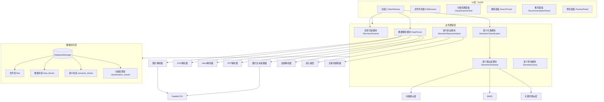

### 2.2 模块依赖关系

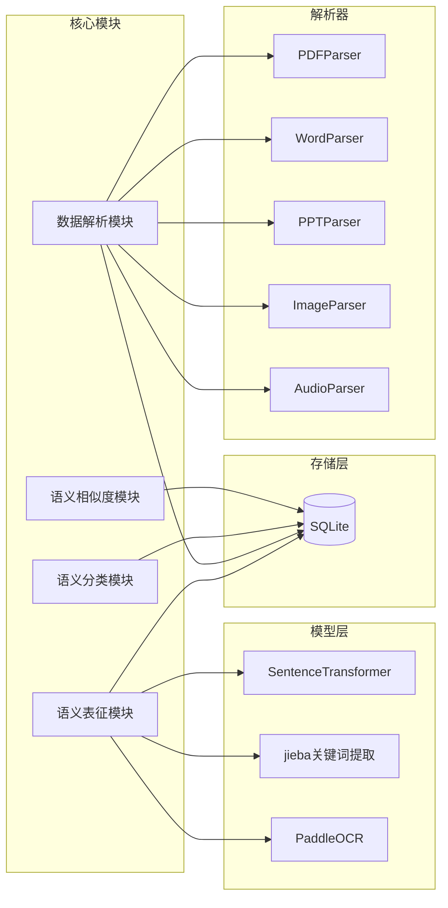

---

## 3. 核心业务流程

### 3.1 文件分析主流程

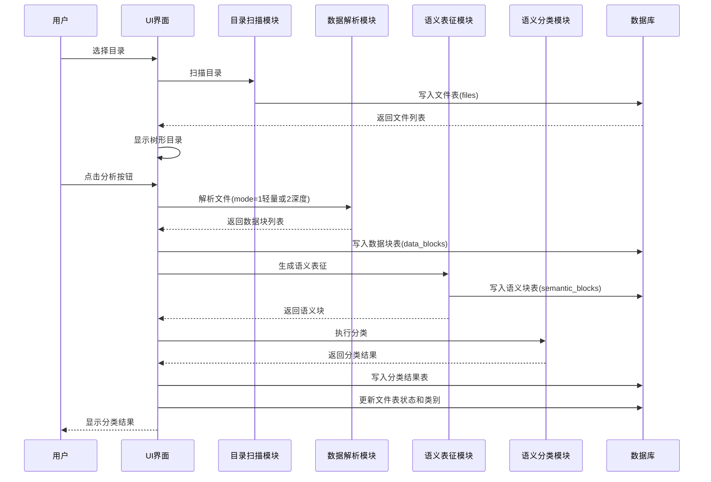

### 3.2 数据解析流程

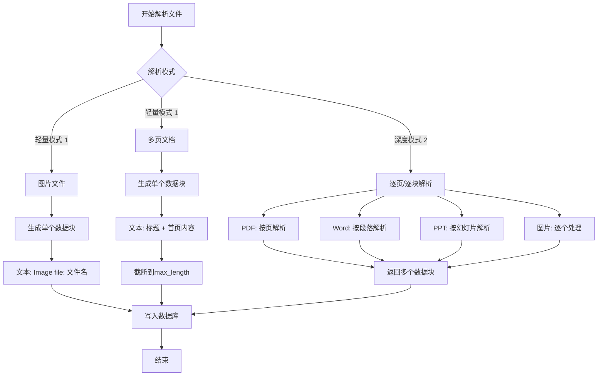

### 3.3 OCR处理流程

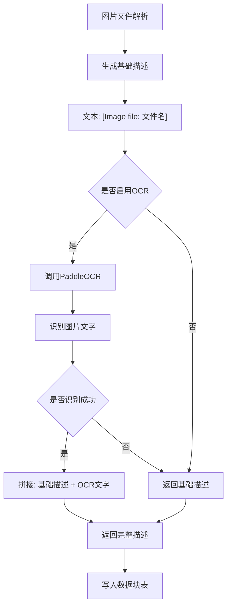

---

## 4. 模块设计

### 4.1 目录扫描模块

#### 4.1.1 类关系图

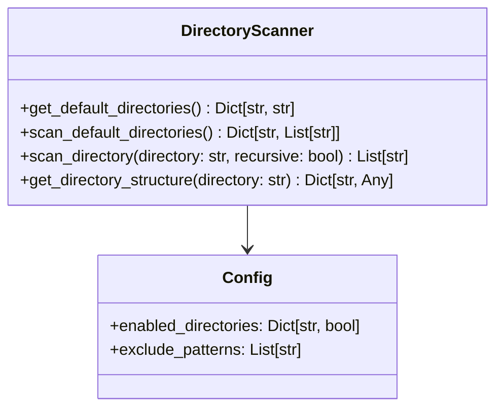

#### 4.1.2 核心方法

| 方法名 | 参数 | 返回值 | 功能描述 |
|-------|------|--------|----------|
| `get_default_directories` | 无 | Dict[str, str] | 获取Windows默认目录路径 |
| `scan_default_directories` | 无 | Dict[str, List[str]] | 扫描所有启用的默认目录 |
| `scan_directory` | directory: str, recursive: bool | List[str] | 扫描指定目录 |
| `get_directory_structure` | directory: str | Dict[str, Any] | 获取目录树形结构 |

### 4.2 数据解析模块

#### 4.2.1 类关系图

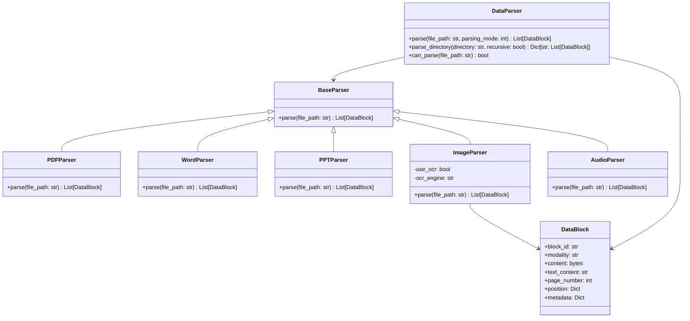

#### 4.2.2 解析模式说明

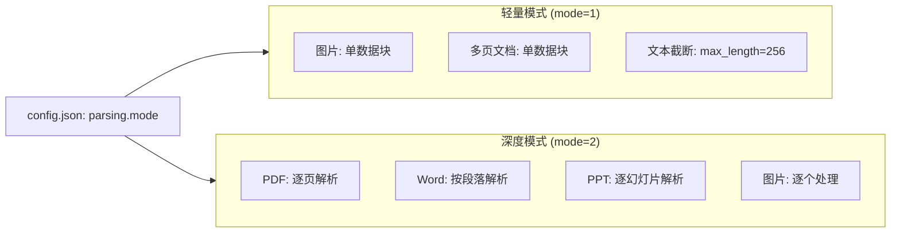

#### 4.2.3 核心方法

| 方法名 | 参数 | 返回值 | 功能描述 |
|-------|------|--------|----------|
| `parse` | file_path: str, parsing_mode: int | List[DataBlock] | 解析文件为数据块 |
| `parse_directory` | directory: str, recursive: bool | Dict[str, List[DataBlock]] | 解析目录下的文件 |
| `can_parse` | file_path: str | bool | 检查是否支持该文件格式 |

### 4.3 语义表征模块

#### 4.3.1 类关系图

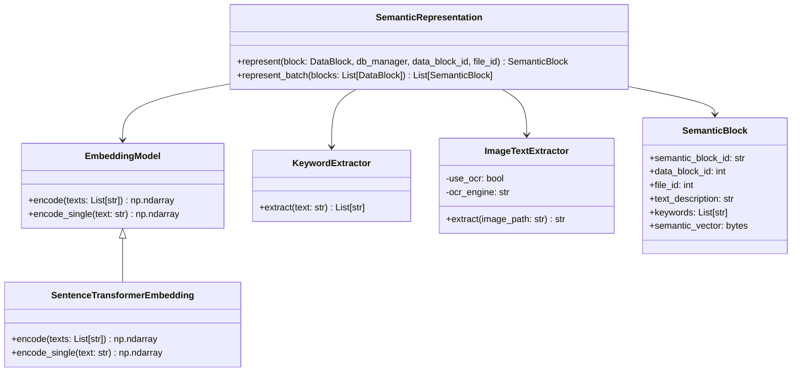

#### 4.3.2 嵌入模型配置

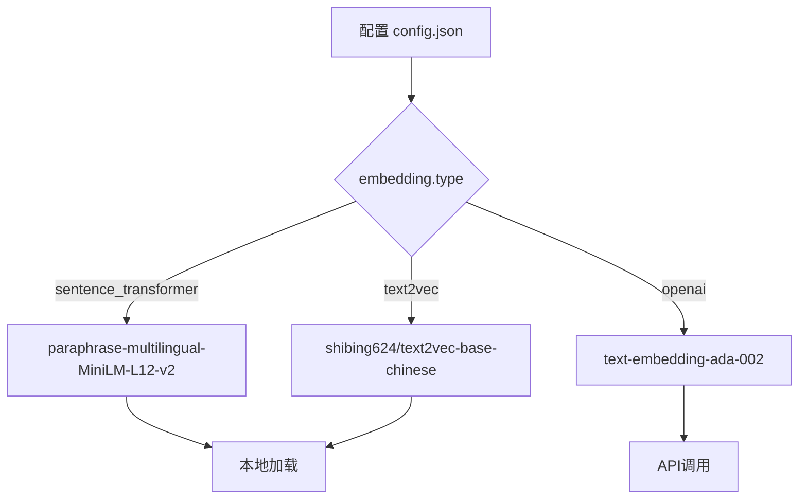

#### 4.3.3 核心方法

| 方法名 | 参数 | 返回值 | 功能描述 |
|-------|------|--------|----------|
| `represent` | block: DataBlock, db_manager, data_block_id, file_id | SemanticBlock | 生成语义块并写入数据库 |
| `represent_batch` | blocks: List[DataBlock] | List[SemanticBlock] | 批量生成语义块 |
| `encode_single` | text: str | np.ndarray | 编码单个文本为语义向量 |
| `extract` | text: str | List[str] | 提取文本关键词 |

### 4.4 语义分类模块

#### 4.4.1 类关系图

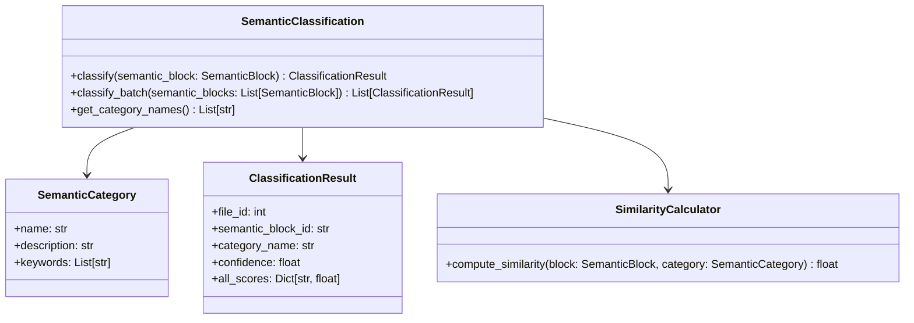

#### 4.4.2 预定义语义类别

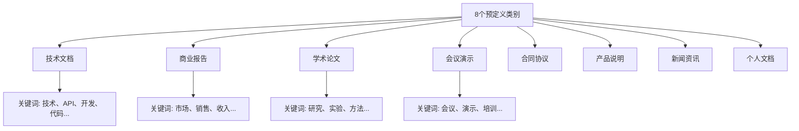

#### 4.4.3 相似度权重配置

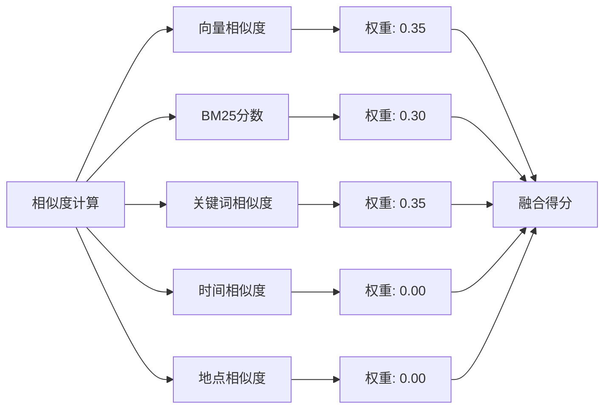

#### 4.4.4 核心方法

| 方法名 | 参数 | 返回值 | 功能描述 |
|-------|------|--------|----------|
| `classify` | semantic_block: SemanticBlock | ClassificationResult | 对语义块进行分类 |
| `classify_batch` | semantic_blocks: List[SemanticBlock] | List[ClassificationResult] | 批量分类 |
| `get_category_names` | 无 | List[str] | 获取所有类别名称 |

### 4.5 语义相似度模块

#### 4.5.1 类关系图

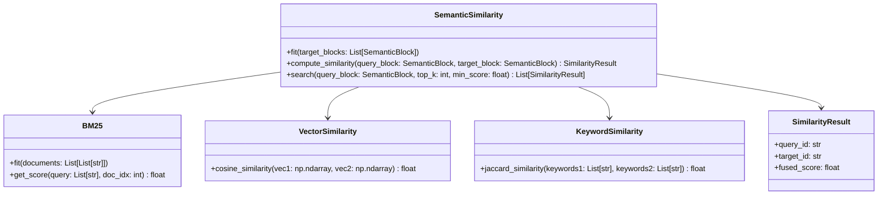

### 4.6 数据库模块

#### 4.6.1 数据表关系图

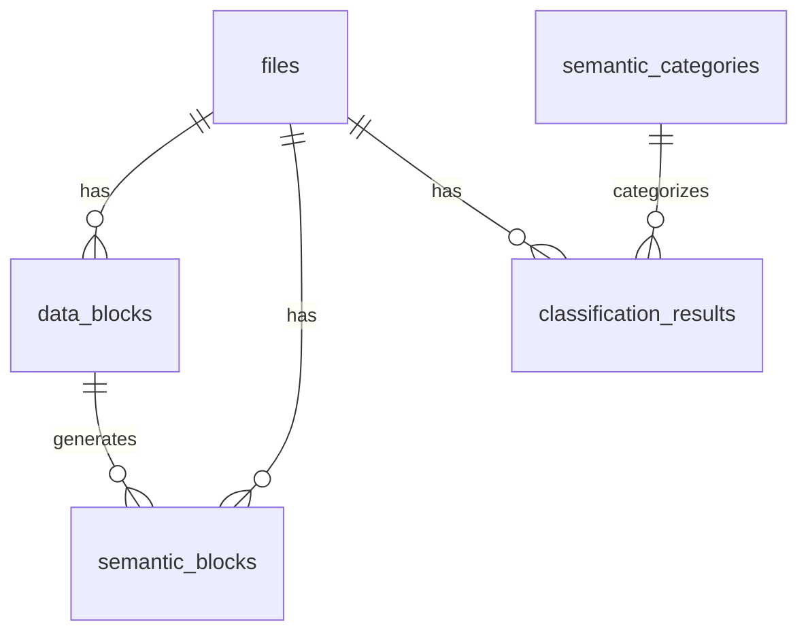

#### 4.6.2 文件表 (files)

```mermaid
classDiagram
    class FileRecord {
        +id: int
        +file_path: str
        +file_name: str
        +file_size: int
        +file_type: str
        +modified_time: datetime
        +created_time: datetime
        +analysis_status: int  "0=待分析,1=初步分析,2=深入分析"
        +semantic_categories: str  "JSON: [{category, confidence}, ...]"
        +directory_path: str
        +added_time: datetime
    }
```

#### 4.6.3 核心方法

| 方法名 | 参数 | 返回值 | 功能描述 |
|-------|------|--------|----------|
| `add_file` | file_path, file_name, file_size, file_type, ... | int | 添加文件记录 |
| `add_data_block` | block_id, file_id, modality, content, ... | int | 添加数据块记录 |
| `add_semantic_block` | semantic_block_id, data_block_id, file_id, ... | int | 添加语义块记录 |
| `add_classification_result` | file_id, semantic_block_id, category_name, ... | int | 添加分类结果 |
| `update_file_status` | file_id, status | bool | 更新文件分析状态 |
| `update_file_semantic_categories` | file_id, categories | bool | 更新文件语义类别 |
| `get_files_by_status` | status | List[FileRecord] | 获取指定状态的文件 |
| `clear_all_tables` | 无 | bool | 清空所有数据表 |

### 4.7 UI模块

#### 4.7.1 类关系图

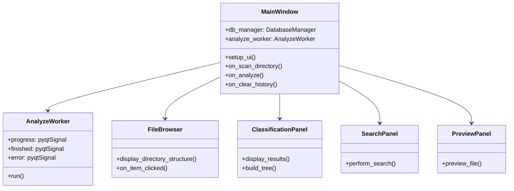

#### 4.7.2 UI布局结构

```mermaid
flowchart TB
    subgraph MainWindow["主窗口布局"]
        direction TB
        Menu[菜单栏: 文件/编辑/视图/帮助]
        Toolbar[工具栏: 分析按钮 | 清空历史 | 搜索框]
        
        subgraph Content["内容区域"]
            direction LR
            Left[推荐面板<br/>左侧面板] --> Right[中心区域<br/>分类结果/文件预览]
        end
        
        Status[状态栏]
    end
    
    Menu --> Toolbar
    Toolbar --> Content
    Content --> Status
```

---

## 5. 数据库设计

### 5.1 文件表 (files)

| 字段名 | 数据类型 | 约束 | 描述 |
|-------|---------|------|------|
| `id` | INTEGER | PRIMARY KEY AUTOINCREMENT | 文件ID |
| `file_path` | TEXT | NOT NULL, UNIQUE | 文件完整路径 |
| `file_name` | TEXT | NOT NULL | 文件名 |
| `file_size` | INTEGER | NOT NULL | 文件大小（字节） |
| `file_type` | TEXT | NOT NULL | 文件类型（扩展名） |
| `modified_time` | TIMESTAMP | NOT NULL | 文件修改时间 |
| `created_time` | TIMESTAMP | NOT NULL | 文件创建时间 |
| `analysis_status` | INTEGER | DEFAULT 0 | 分析状态（0:待分析, 1:初步分析, 2:深入分析） |
| `semantic_categories` | TEXT | | 语义类别JSON |
| `directory_path` | TEXT | NOT NULL | 所在目录路径 |
| `added_time` | TIMESTAMP | DEFAULT CURRENT_TIMESTAMP | 添加时间 |

### 5.2 数据块表 (data_blocks)

| 字段名 | 数据类型 | 约束 | 描述 |
|-------|---------|------|------|
| `id` | INTEGER | PRIMARY KEY AUTOINCREMENT | 数据块ID |
| `block_id` | TEXT | NOT NULL, UNIQUE | 数据块唯一标识 |
| `file_id` | INTEGER | NOT NULL, FOREIGN KEY | 关联文件ID |
| `modality` | TEXT | NOT NULL | 模态类型 |
| `content` | BLOB | | 原始内容 |
| `text_content` | TEXT | | 文本内容 |
| `page_number` | INTEGER | | 页码 |
| `position` | TEXT | | 位置信息JSON |
| `metadata` | TEXT | | 元数据JSON |
| `created_time` | TIMESTAMP | DEFAULT CURRENT_TIMESTAMP | 创建时间 |

### 5.3 语义块表 (semantic_blocks)

| 字段名 | 数据类型 | 约束 | 描述 |
|-------|---------|------|------|
| `id` | INTEGER | PRIMARY KEY AUTOINCREMENT | 语义块ID |
| `semantic_block_id` | TEXT | NOT NULL, UNIQUE | 语义块唯一标识 |
| `data_block_id` | INTEGER | NOT NULL, FOREIGN KEY | 关联数据块ID |
| `file_id` | INTEGER | NOT NULL, FOREIGN KEY | 关联文件ID |
| `text_description` | TEXT | NOT NULL | 文本描述 |
| `keywords` | TEXT | NOT NULL | 关键词JSON数组 |
| `semantic_vector` | BLOB | | 语义向量 |
| `created_time` | TIMESTAMP | DEFAULT CURRENT_TIMESTAMP | 创建时间 |

### 5.4 语义类别表 (semantic_categories)

| 字段名 | 数据类型 | 约束 | 描述 |
|-------|---------|------|------|
| `id` | INTEGER | PRIMARY KEY AUTOINCREMENT | 类别ID |
| `category_name` | TEXT | NOT NULL, UNIQUE | 类别名称 |
| `description` | TEXT | NOT NULL | 类别描述 |
| `keywords` | TEXT | NOT NULL | 类别关键词JSON数组 |
| `created_time` | TIMESTAMP | DEFAULT CURRENT_TIMESTAMP | 创建时间 |

### 5.5 分类结果表 (classification_results)

| 字段名 | 数据类型 | 约束 | 描述 |
|-------|---------|------|------|
| `id` | INTEGER | PRIMARY KEY AUTOINCREMENT | 结果ID |
| `file_id` | INTEGER | NOT NULL, FOREIGN KEY | 关联文件ID |
| `semantic_block_id` | TEXT | NOT NULL | 关联语义块ID |
| `category_name` | TEXT | NOT NULL | 类别名称 |
| `confidence` | REAL | NOT NULL | 置信度（0-1） |
| `all_scores` | TEXT | | 所有类别得分JSON |
| `created_time` | TIMESTAMP | DEFAULT CURRENT_TIMESTAMP | 创建时间 |

---

## 6. 配置文件

### 6.1 配置文件结构

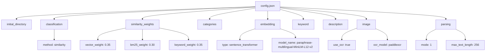

### 6.2 配置项说明

| 配置项 | 类型 | 默认值 | 说明 |
|-------|------|-------|------|
| `initial_directory` | string | - | 初始目录路径 |
| `classification.method` | string | "similarity" | 分类方法 |
| `embedding.type` | string | "sentence_transformer" | 嵌入模型类型 |
| `keyword.top_k` | int | 10 | 关键词提取数量 |
| `image.use_ocr` | bool | true | 是否使用OCR |
| `parsing.mode` | int | 1 | 解析模式: 1轻量/2深度 |
| `parsing.max_text_length` | int | 256 | 轻量模式最大文本长度 |

---

## 7. 测试

### 7.1 测试目录结构

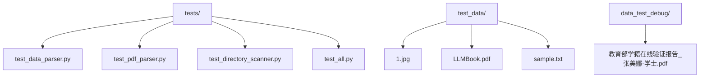

### 7.2 PDF解析测试输出规则

```mermaid
flowchart LR
    A[PDF解析测试] --> B{数据块类型}
    
    B -->|文本块| C[txt_block_<id>.txt]
    B -->|图片块| D[pic_block_<id>.<扩展名>]
```

---

## 8. 打包与部署

### 8.1 打包配置

```mermaid
flowchart TB
    A[PyInstaller打包] --> B[文件分析管理器.spec]
    B --> C[build_exe.py]
    C --> D[dist/文件分析管理器/]
    D --> E[文件分析管理器.exe]
    
    E --> F[开发模式: python ui/main_window.py]
    E --> G[打包模式: 双击exe运行]
```

---

## 9. 总结

### 9.1 已实现功能

```mermaid
flowchart TB
    A[已实现功能] --> B[✓ 多格式文件解析]
    A --> C[✓ 轻量/深度解析模式]
    A --> D[✓ 语义表征生成]
    A --> E[✓ OCR图片识别]
    A --> F[✓ 语义相似度计算]
    A --> G[✓ 语义分类]
    A --> H[✓ SQLite数据库]
    A --> I[✓ 分析状态管理]
    A --> J[✓ PyQt5图形界面]
    A --> K[✓ 树形目录展示]
    A --> L[✓ 打包exe]
```

### 9.2 技术特点

- **模块化设计**：各模块职责清晰，易于维护和扩展
- **配置灵活**：通过配置文件控制解析模式、OCR开关、分类方法等
- **数据库持久化**：支持分析状态跟踪和历史数据管理
- **GUI交互友好**：支持目录树展示、分类结果展示

---

**文档版本**：3.0  
**更新日期**：2026-03-10  
**主要更新**：
- 新增目录扫描模块设计（含mermaid类图）
- 新增数据解析模块详细设计（轻量/深度解析模式）
- 新增OCR功能集成说明（PaddleOCR）
- 新增数据库模块设计（SQLite，5张表）
- 新增UI模块设计（PyQt5）
- 新增配置文件完整说明
- 新增测试目录和打包部署说明
- 整体架构、类关系、核心流程均采用mermaid方式生成
